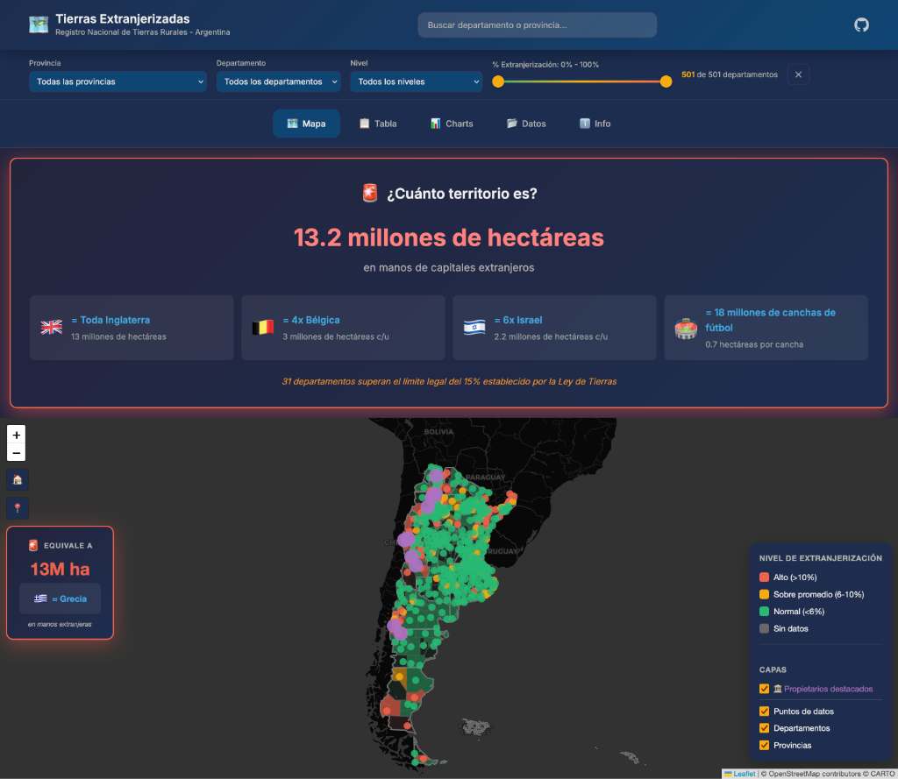

# Tierras Extranjerizadas - Argentina



## 🚨 ¿Por qué existe este proyecto?

Todo comienza con un dato llamativo: **el departamento de Campana, en la provincia de Buenos Aires, tiene más del 50% de su territorio rural en manos extranjeras**. 

Este hallazgo en los datos oficiales del Registro Nacional de Tierras Rurales disparó la necesidad de entender la dimensión real del problema:

> *"¿Cuántos otros departamentos están en esta situación? ¿Estamos hablando de casos aislados o patrones sistemáticos? ¿Dónde están los 13 millones de hectáreas extranjerizadas que se mencionan en los informes?"*

Este visor nace para **responder esas preguntas con datos**, democratizando el acceso a información que, aunque pública, suele estar escondida en PDFs o tablas difíciles de interpretar.

## 🎯 Objetivo
El propósito es facilitar el acceso ciudadano a la información pública sobre la distribución de la propiedad de la tierra en Argentina. Buscamos:
1.  **Visibilizar** el impacto real de la extranjerización mediante comparaciones tangibles (ej: "equivale a toda Inglaterra").
2.  **Identificar patrones** geográficos de concentración.
3.  **Monitorear** el cumplimiento de la Ley de Tierras (Ley 26.737), que establece un límite del 15% a nivel nacional, provincial y departamental.

## 💾 Datos Abiertos y Recursos
Este proyecto se nutre exclusivamente de fuentes oficiales y abiertas. Creemos en la transparencia y en el poder de los datos abiertos para el control ciudadano.

**Fuentes principales:**
*   **[Registro Nacional de Tierras Rurales (Argentina.gob.ar)](https://www.argentina.gob.ar/justicia/tierrasrurales/datos/extranjerizacion-provincia)**: Datos oficiales de porcentajes de extranjerización.
*   **[Observatorio de Tierras (CONICET)](https://iesyh.conicet.gov.ar/observatorio-de-tierras/)**: Investigación académica y datos georreferenciados.
*   **[Instituto Geográfico Nacional (IGN)](https://www.ign.gob.ar/)**: Capas base de geometrías provinciales y departamentales.
*   **[Chequeado: "Quiénes son los dueños de las tierras en la Argentina"](https://chequeado.com/investigacion/quienes-son-los-duenos-de-las-tierras-en-la-argentina/)**: Investigación periodística que aportó datos sobre grandes propietarios.

Todos los datos procesados están disponibles en la carpeta `/data` de este repositorio para quien quiera reutilizarlos.

## Funcionalidades
- **Mapa Interactivo SOTA**: Visualización de alto rendimiento con Leaflet.
- **Panel de Impacto Dinámico**: Cálculos en tiempo real de equivalencias territoriales.
- **Filtros Sincronizados**: Cruce de variables por provincia, departamento y nivel de extranjerización.
- **Visualización de Propietarios**: Capa especial de terratenientes destacados.
- **Charts Integrados**: Análisis estadístico complementario al mapa.

## Uso local (desarrollo)
Para desarrollo local, servir con un servidor estático:

```bash
python3 -m http.server 8080
```

Luego abrir: `http://localhost:8080`

## Estructura del proyecto
- `index.html`: layout principal y carga de módulos.
- `css/styles.css`: estilos del visor (Glassmorphism UI).
- `js/`: módulos de la app (mapa, tabla, charts, filtros, búsqueda, impacto).
- `config/`: configuración de app, capas y charts.
- `data/web/`: GeoJSONs optimizados para la web.

## Agradecimientos
Este proyecto está basado en el trabajo del [Observatorio de Tierras de CONICET](http://www.bibliotecadigital.gob.ar/items/show/1564).

Gracias a **@jclav** de **@geoinquietos** Argentina por la inspiración y apoyo a la comunidad geo.

## Contribuciones
Este es un **proyecto 100% abierto**. Podés agregar nuevas capas, mejorar visualizaciones, sumar datos o proponer cambios. ¡Las contribuciones son bienvenidas!
